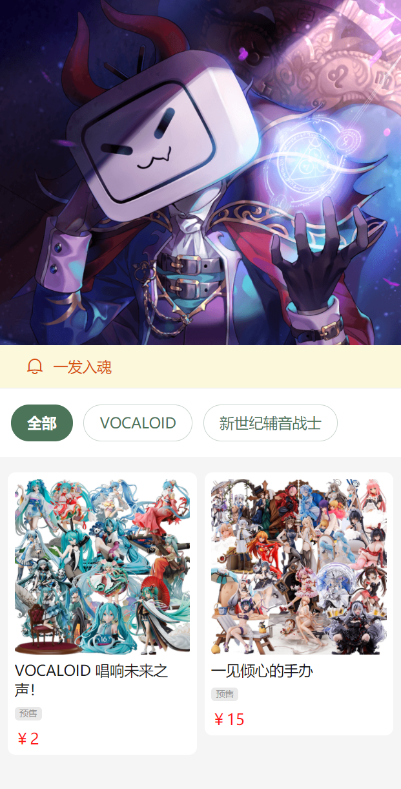
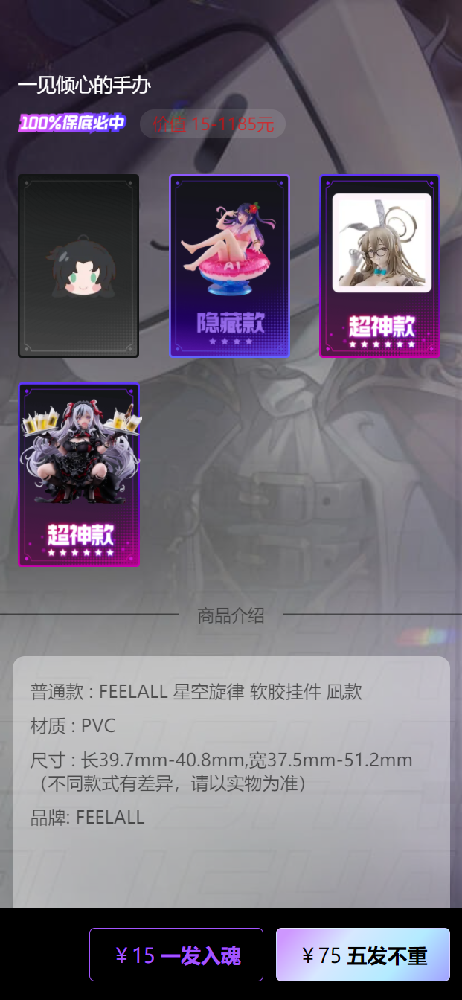
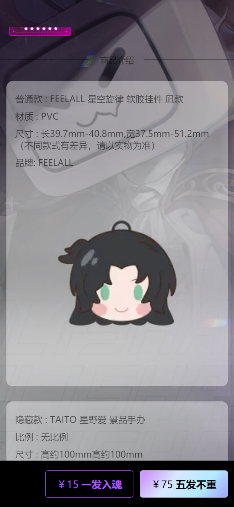
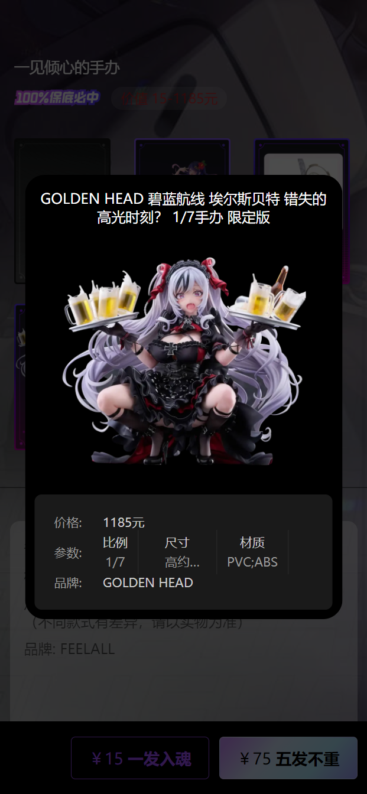
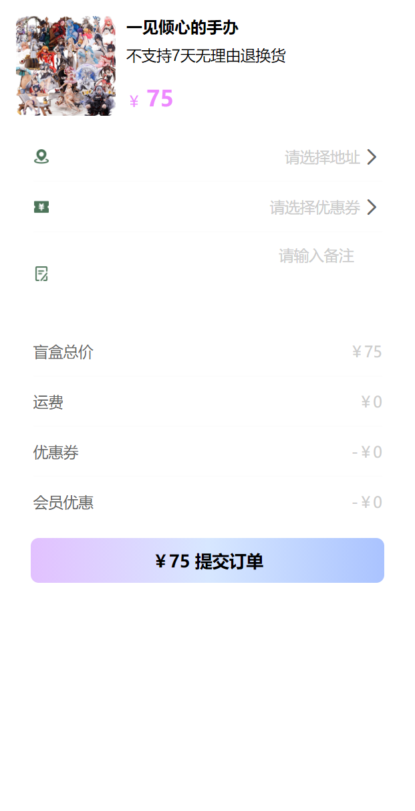
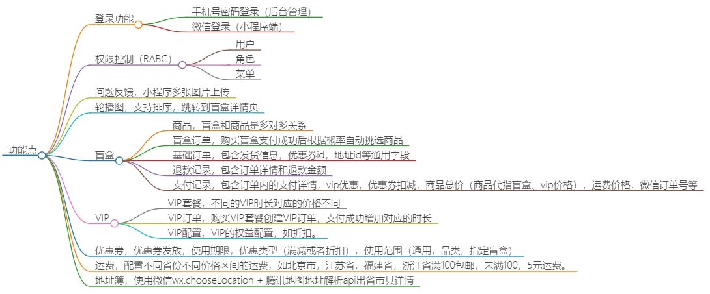

# 项目介绍

本项目模仿b站的魔力赏盲盒，每个盲盒中可以添加多个商品，支付成功后根据概率随机挑选盲盒内的商品。同时加入了VIP，优惠券，运费计算等功能。

## 项目预览

## 功能点

## 技术栈

### 微信小程序端

在小程序端我选择使用京东的`Taro`小程序开发框架。其实采用`Taro`，`Uni-App`，`微信小程序官方语法`这三个框架开发并没有多大的差别。它们的配置，目录结构，API，都是遵循统一的规范。主要差别是在于`Taro`对于`Vue3`+`TypeScript`支持较好。

| 技术         | 说明                                                                | 官网                                                     |
|------------|-------------------------------------------------------------------|--------------------------------------------------------|
| Taro       | 小程序统一开发框架                                                         | <https://docs.taro.zone/>                              |
| Vue3       | Vue 基于标准 HTML 拓展了一套模板语法。Vue 会自动跟踪 JavaScript 状态并在其发生变化时响应式地更新 DOM | <https://cn.vuejs.org/>                                  |
| NutUI      | 支持TypeScript提示的TaroUI组件库，80+ 高质量组件，覆盖移动端主流场景                      | <https://nutui.jd.com/taro/vue/4x/#/zh-CN/guide/intro> |
| Pinia      | 全局状态管理框架，支持TypeScript类型提示                                         | <https://pinia.web3doc.top/>                           |
| TypeScript | 让 JS 具备类型声明                                                       | <https://www.typescriptlang.org/>                      |
| ESLint     | 语法校验和格式整理                                                         | <https://eslint.org/>                                  |

### Java服务端

| 技术             | 说明                                                                             | 官网                                                                                     |
|----------------|--------------------------------------------------------------------------------|----------------------------------------------------------------------------------------|
| SpringBoot3    | Web应用开发框架，需要JDK17及以上版本                                                         | <https://spring.io/projects/spring-boot>                                                 |
| SaToken        | 一个轻量级 Java 权限认证框架，主要解决：登录认证、权限认证、单点登录、OAuth2.0、分布式Session会话、微服务网关鉴权 等一系列权限相关问题 | <https://sa-token.cc/>                                                                   |
| Jimmer         | 不仅有Mybatis的灵活性也有Hibernate的复用性                                                  | <https://babyfish-ct.github.io/jimmer-doc/zh/>                                               |
| QiFanGenerator | 自己写的代码生成器，快速生成前后端增删改查。                                                         | 无官网，在代码里面参考`@GenEentity`和`@GenXXXField`注解就行了                                           |
| 阿里云OSS         | 存储图片，学习用途基本上免费。                                                                | [对象存储 OSS-阿里云帮助中心 (aliyun.com)](https://help.aliyun.com/zh/oss/)                       |
| 微信小程序服务端API    | 用户登录，订阅消息等接口                                                                   | [微信开放文档 (qq.com)](https://developers.weixin.qq.com/miniprogram/dev/OpenApiDoc/)        |
| 微信支付V3         | 用户支付订单                                                                         | [微信支付开发者文档 (qq.com)](https://pay.weixin.qq.com/wiki/doc/apiv3/wxpay/pages/index.shtml) |
| 腾讯地图Api         | 通过地址详情解析出省、市、区                                                                | [腾讯地图](https://lbs.qq.com/dev/console/home) |

### 后台管理端

| 技术             | 说明                                                                | 官网                                   |
|----------------|-------------------------------------------------------------------|--------------------------------------|
| Vite           | 开箱即用的现代前端打包工具                                                     | <https://cn.vitejs.dev/>               |
| Vue3           | Vue 基于标准 HTML 拓展了一套模板语法。Vue 会自动跟踪 JavaScript 状态并在其发生变化时响应式地更新 DOM | <https://cn.vuejs.org/>                |
| Vue Router     | Vue官方路由管理框架                                                       | <https://router.vuejs.org/>            |
| ElementUI Plus | 支持TypeScript提示的Vue3前端UI框架                                         | <https://element-plus.gitee.io/zh-CN/> |
| Pinia          | 全局状态管理框架，支持TypeScript类型提示                                         | <https://pinia.web3doc.top/>         |
| TypeScript     | 让 JS 具备类型声明                                                       | <https://www.typescriptlang.org/>    |
| ESLint         | 语法校验和格式整理                                                         | <https://eslint.org/>                |
| DayJS          | 日期取值/赋值/运算等操作                                                     | <https://dayjs.fenxianglu.cn/>         |
| LodashJs       | JS各种常用的工具方法                                                       | <https://www.lodashjs.com/>            |

## 运行

### 环境

- jdk17
- maven
- redis
- mysql8
- node18+
- 微信小程序（企业主体）
- 微信支付
- 阿里云oss
- 腾讯地图api key
- 小程序申请`wx.chooseLocation`权限

### 后端启动

1. 导入sql`database.sql`初始数据库
2. 配置微信支付/小程序/阿里云oss/腾讯地图apiKey
3. 修改`application-dev.yml`中`mysql`和`redis`为你自己的密码
4. 启动`ServerApplication`
5. target/generated-sources/annotations右键mark directory as/generated source root

### 后台管理启动

1. `npm install`
2. `npm run api-admin`同步接口和ts类型，先启动后端
3. `npm run dev`

### 小程序启动

1. `yarn install`
2. `yarn api`同步接口和ts类型，先启动后端
3. `project.config.json`修改`appId`
4. `yarn dev:weapp`
5. 导入`mystery-box-miniprogram`到微信开发者工具
